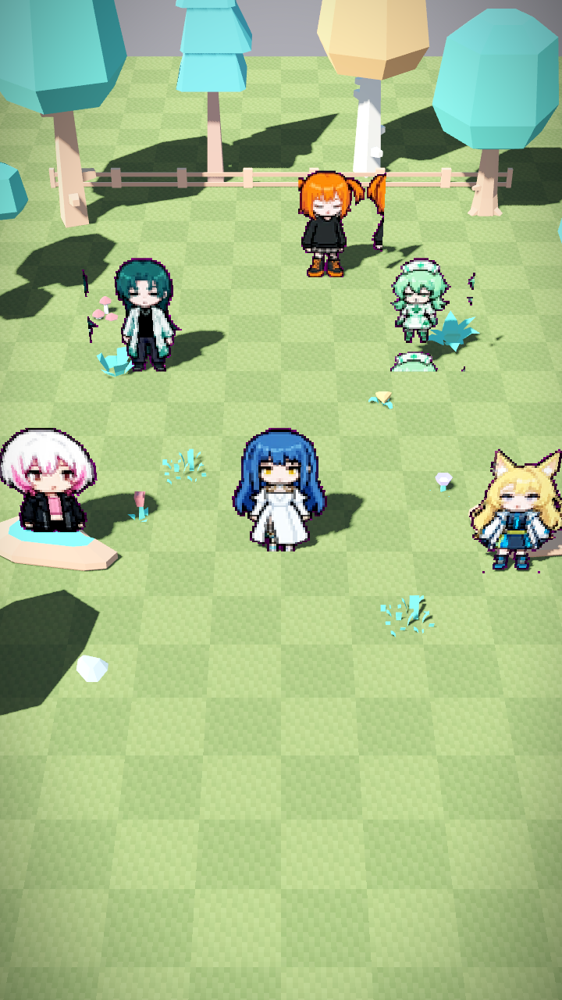
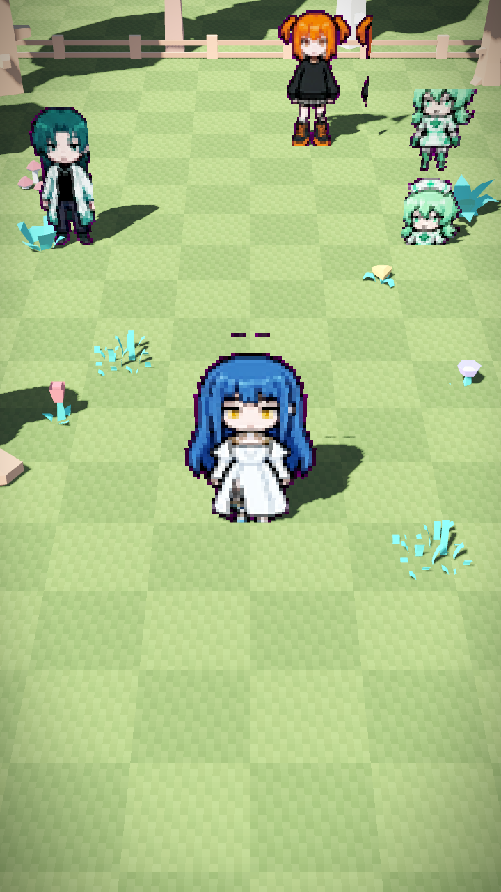
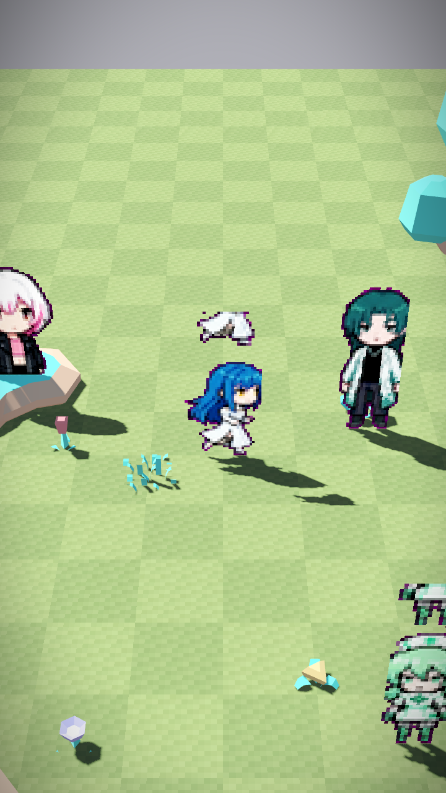
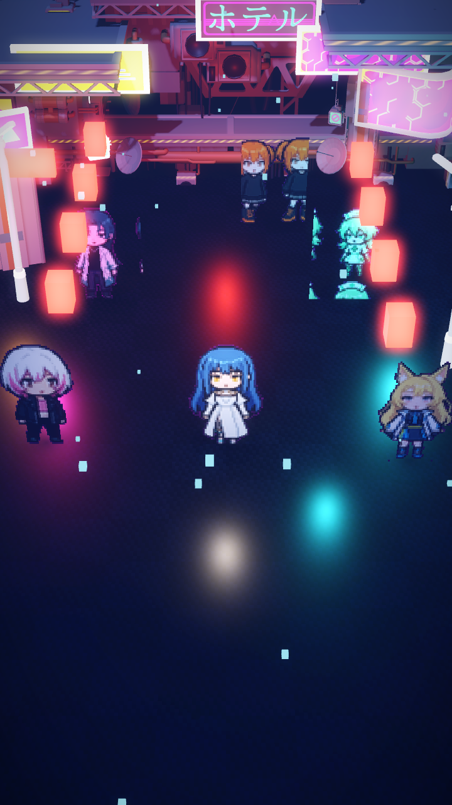
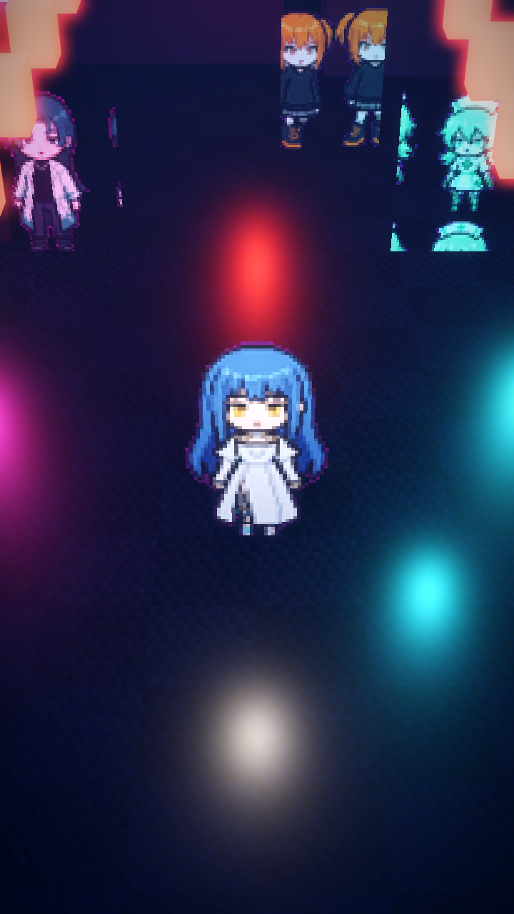
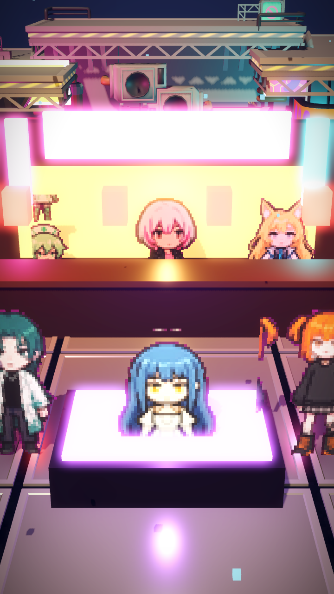
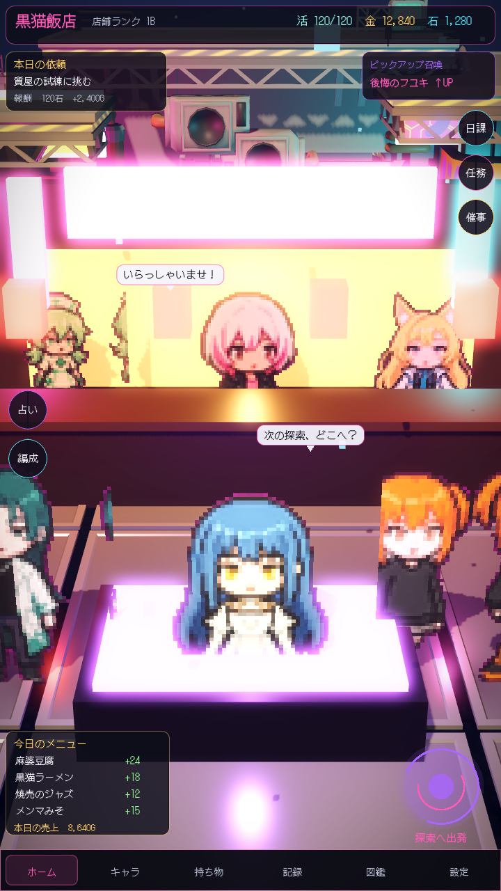
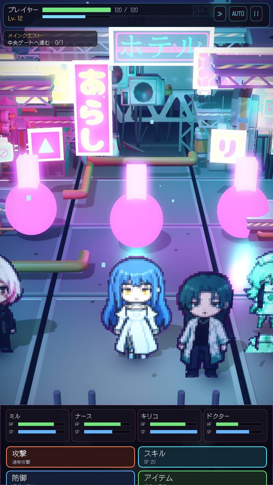

# HD-2D 探索画面（プロトタイプ）

参照：ポケモン ピクセルリメイク風（3D 空間に 2D ドット絵キャラが立つオクトパストラベラー系の表現）。

## 結論：実現できる

現状の探索画面（`src/ui/dive_view.gd`）は **Control の 2D `_draw()` による横スクロール**だが、
HD-2D は別アプローチ＝**3D 空間 ＋ 2D ドット絵ビルボード**で作る。
既存のピクセルスプライト（`assets/generated/sprites/<id>/<anim>_f<n>.png`, 144x192）を
そのまま `Sprite3D` のテクスチャに使えるので、アセットを作り直す必要はない。

GL Compatibility レンダラ（本プロジェクトの設定）でも 3D・影・glow は動作する。
SSAO/被写界深度（DOF）など重い後処理は使わない方針。

## プロトタイプの場所

- 画面本体：`src/ui/hd2d_view.gd`
- 起動シーン：`hd2d_test.tscn`（エディタで開いて **F6** で直接実行）

操作：
- **WASD / 矢印** … プレイヤー（kiriko）移動（カメラ相対）
- **Q / E** … カメラを 90° 左右回転（オクトラ風にワールドが主人公の周りを回る）
- **R / F** … ズームイン / アウト

NPC（doctor / nurse / mil / muu / yuzuki）が中庭に立ち、カメラは斜め見下ろしで追従する。
中庭の小物（木・柵・岩・茂み・花・石畳）は **Kenney Nature Kit（CC0）** の glTF モデル
（`assets/third_party/kenney_naturekit/`）を `_build_props()` で配置している。

## 押さえた要点（Godot での HD-2D 定石）

| 要点 | 設定 | 理由 |
|---|---|---|
| **Y 固定ビルボード** | `Sprite3D.billboard = BILLBOARD_FIXED_Y` | キャラは直立のまま常にカメラを向く。フルビルボードだと傾いたカメラで寝てしまう |
| **ニアレストフィルタ** | `texture_filter = NEAREST` | ドット絵をぼかさずくっきり |
| **アルファスシザー** | `alpha_cut = ALPHA_CUT_DISCARD` | 深度バッファに書き込まれ前後ソートが正しくなる＋シルエットの影を落とせる |
| **影** | `cast_shadow = ON` ＋ `DirectionalLight3D.shadow_enabled` | 接地感。半透明のままだと影が出ない／ソートが崩れる |
| **傾けた perspective カメラ** | `fov ≈ 42`, 高さ 8・距離 9（見下ろし ≈ 42°） | オクトラ系のアングル |
| **回転＋ズームカメラ** | Q/E で 90° 回転・R/F でズーム（周回リグ） | ワールドが主人公の周りを回るオクトラの操作感 |
| **ヴィネット** | 全画面 ColorRect ＋ `hd2d_vignette.gdshader` | 画面端を暗く落とすオクトラの定番。レンダラ非依存 |
| **柔らかい影** | `DirectionalLight3D.shadow_blur` | 接地の影をふんわり |
| **控えめな glow** | `Environment.glow_*`（bloom 0.05） | HD-2D の柔らかい発光感 |

> 参考：[GSansigolo/SimpleHD2D](https://github.com/GSansigolo/SimpleHD2D)（Godot 4.1, Forward+）。
> 回転カメラ（SpringArm3D + Q/E 回転 / R/F ズーム）・ヴィネット・控えめ glow の構成を踏襲。
> 同リポジトリは **被写界深度（DOF, tilt-shift 風）と SSIL** も使うが、これらは **Forward+ 専用**で
> 本プロジェクトの GL Compatibility では出ない。寄せたい場合はレンダラ切替が前提（下記）。

## 既存ゲームへの組み込み方針（次の段階）

このプロトタイプは `dive_view` から独立した検証用。実ゲームに入れる場合の選択肢：

1. **探索画面を HD-2D に置き換える** … `dive_view` を SubViewport ベースの 3D に作り替え、
   既存の戦闘ロジック（`KuroSim`）はそのまま、表示層だけ差し替える。影響範囲が大きい。
2. **「店の周辺を歩く」新画面として追加** … 集中前のホーム/中庭探索として独立追加。
   コアループ（ホーム→ダイブ→帰還）を壊さず段階導入できる。**推奨**。

## さらに寄せるなら（任意）

- **低解像度 SubViewport → 拡大**：3D を低解像度で描いて整数倍拡大すると、より「チャンキー」なピクセル感になる。
  逆にリメイク参照のような高精細路線なら現状のフル解像度のままでよい。
- **タイルシフト風 DOF**：手前/奥をぼかすと一気にミニチュア感が出るが、GL Compatibility では非対応のため Forward+ 切替が前提。
- 桜・芝・ベンチなどの 3D 小物や、ビルボードの草を増やすと参照画像の中庭の密度に近づく。

## レンダリング確認（プレビュー）

Godot 4.6（GL Compatibility・ソフトウェアGL）でオフスクリーン撮影した実画面。
撮影は `tools/hd2d_shot.gd`（`xvfb-run … -s tools/hd2d_shot.gd`）。

| 全体俯瞰 | 正面 | 回転 |
|---|---|---|
|  |  |  |

ビルボードのピクセルキャラが 3D の中庭に立ち、足元に影が落ち、傾けた周回カメラ＋
ヴィネットで HD-2D として成立している。中庭の小物は Kenney Nature Kit（CC0）。

## サイバーパンク中華（黒猫飯店）テーマ

`THEME = "cyberpunk"`（`hd2d_view.gd`）で、暗い夜の路面＋ネオン看板＋赤提灯＋店先の暖色に切替。
ライティングのレシピ：暗い藍の背景、弱い青い月光、ネオンの強い glow（HDR 閾値）＋フォグ、
濡れアスファルト（低 roughness ＋ metallic でネオンの映り込み）、シアン/マゼンタ/赤の OmniLight。
小物は **Quaternius Cyberpunk Game Kit（CC0）の実モデルのみ**で構成（`_build_props_cyberpunk()`）。ビル/ネオン看板/街灯/AC/アンテナ/TV/パイプ/ケーブル/レール。看板・街灯はテクスチャを自発光させてネオン化。
床もキットの Platform_4x4 天面をタイル状に敷いてキット由来にしている（暗いベース板を一枚下に敷いて隙間/光漏れを防止）。※床は現状 Platform を多数インスタンス化しているため、実ゲームでは MultiMesh か単一床メッシュに置換して最適化する。

| 全体俯瞰 | 正面 |
|---|---|
|  |  |

キット候補（CC0 中心）は `docs/HD2D_ASSETS.md` の「サイバーパンク × 中華飯店」を参照。

### 追加要素（影・粒子・DOF）

- **ブロブシャドウ**：ビルボードの落ち影は光源視点で薄くなり不安定なため、足元に板の影テクスチャを
  寝かせて確実に接地させる（`_add_blob_shadow`）。主人公は追従。
- **ボクセル粒子**：小さな発光キューブを `CPUParticles3D` で漂わせ空気の粒子感を出す（`_build_particles`、全レンダラ可）。
- **被写界深度（DOF）**：カメラに `CameraAttributesPractical`（near/far blur）を設定済み。
  ただし **DOF は Forward+ / Mobile レンダラでのみ有効**。本プロジェクトは GL Compatibility のため
  現状は無視される。DOF を出すには `project.godot` の `rendering_method` を `mobile`（推奨）か
  `forward_plus` に切替が必要（Web 書き出しは WebGPU 前提になる点に注意）。

## ホームジオラマ（黒猫飯店）

`stage_theme = "home"`（`home3d_test.tscn` / F6）。参照ホーム画面のレイアウトに合わせ、
中央 HD-2D ジオラマとして：奥にカウンター＋店番チビ＋暖色の店内、ピンクのネオン「黒猫飯店」看板、
手前に光る紫のパーティテーブル（編成卓）をパーティが囲む。窓の外は冷たいネオン都市で寒暖対比。
カメラは注視点固定の据置構図（`_cam_target_override`）。実画面では周囲を 2D UI（依頼/ガチャ/メニュー/
出発ポータル/下部ナビ）が囲む想定で、3D はこの中央ステージを担う。

### 2D UI を重ねた“画面”

`home_screen.tscn`：HD-2D ジオラマ（`Stage`）の上に 2D UI チロー（`HomeOverlay`）を重ね、トップバー/本日の依頼/ガチャ/サイドアイコン/今日のメニュー/探索へ出発ポータル/下部ナビ/吹き出しを配置。参照ホーム画面のレイアウトを再現。UI は現状プロトタイプ表示で、実データは main.gd 側から流し込む想定。

## 潜航（戦闘）画面（縦・パーティ手前／敵奥）

`stage_theme = "dive"`（`dive_screen.tscn`）。サイバーパンクステージを再利用し、パーティを手前(z+)、
敵（紫の炎モンスター＝発光球＋コア＋点光源）を奥(z-)に置いた縦構図。`DiveOverlay`（`dive_overlay.gd`）で
上＝プレイヤー情報/HP/EXP/クエスト/AUTO、下＝パーティHP/SPカード＋コマンド（攻撃/スキル/防御/アイテム）。
タップで `command_pressed(id)` を発火（KuroSim/main.gd 側で接続する想定）。

